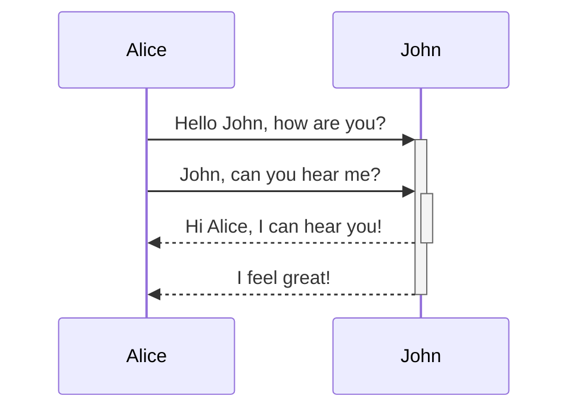

# This is a heading 1

## This is a heading 2

### This is a heading 3

#### This is a heading 4

##### This is a heading 5

###### This is a heading 6

---

*nya*             **nya *nya*  
nyaa**                nya

---

### Lists
-   Item 1
-   Item 2
    -   Item 2a
    -   Item 2b

1.  Item 1
2.  Item 2
3.  Item 3
    1.  Item 3a
    2.  Item 3b


---

### Blockquotes

```md
> Human beings face ever more complex and urgent problems, and their effectiveness in dealing with these problems is a matter that is critical to the stability and continued progress of society.

\- Doug Engelbart, 1961
```

> Human beings face ever more complex and urgent problems, and their effectiveness in dealing with these problems is a matter that is critical to the stability and continued progress of society.

\- Doug Engelbart, 1961

---

### Inline code

```md
Text inside `backticks` on a line will be formatted like code.
```

Text inside `backticks` on a line will be formatted like code.

### Task list

```md
- [x] #tags, [links](), **formatting** supported
- [x] list syntax required (any unordered or ordered list supported)
- [x] this is a complete item
- [?] this is also a complete item (works with every character)
- [ ] this is an incomplete item
- [ ] tasks can be clicked in Preview to be checked off
```

-   [#tags](https://publish.obsidian.md/#tags), [links](https://publish.obsidian.md/), **formatting** supported
-   list syntax required (any unordered or ordered list supported)
-   this is a complete item
-   this is also a complete item (works with every character)
-   this is an incomplete item
-   tasks can be clicked in Preview to be checked off

---

### Tables

You can create tables by assembling a list of words and dividing them with hyphens `-` (for the first row), and then separating each column with a pipe `|`:

```md
First Header | Second Header
------------ | ------------
Content from cell 1 | Content from cell 2
Content in the first column | Content in the second column
```

First Header | Second Header
------------ | ------------
Content from cell 1 | Content from cell 2
Content in the first column | Content in the second column

---

```md
Tables can be justified with a colon | Another example with a long title
:----------------|-------------:
because of the `:` | these will be justified
```

Tables can be justified with a colon | Another example with a long title
:----------------|-------------:
because of the `:` | these will be justified

If you put links in tables, they will work, but if you use Piped Links, the pipe must be escaped with a `\` to prevent it being read as a table element.

```md
First Header | Second Header
------------ | ------------
[[Format your notes\|Formatting]]	|  [[Keyboard shortcuts\|hotkeys]]
```


First Header | Second Header
------------ | ------------
[[Format your notes\|Formatting]]	|  [[Keyboard shortcuts\|hotkeys]]


---

### Strikethrough

```md
Any word wrapped with two tildes (like ~~this~~) will appear crossed out.
```

Any word wrapped with two tildes (like ~~this~~) will appear crossed out.

---

### Highlighting

```md
Use two equal signs to ==highlight text==.
```

Use two equal signs to ==highlight text==.

alternatively use the plugin

<mark style="background: #FFB8EBA6;">colors colors colors</mark> 
<mark style="background: #FF5582A6;">colors colors colors</mark> 
<mark style="background: #FFB86CA6;">colors colors colors</mark> 
<mark style="background: #FFF3A3A6;">colors colors colors</mark> 
<mark style="background: #BBFABBA6;">colors colors colors</mark> 
<mark style="background: #ABF7F7A6;">colors colors colors</mark> 
<mark style="background: #ADCCFFA6;">colors colors colors</mark> 
<mark style="background: #D2B3FFA6;">colors colors colors</mark> 
<mark style="background: #CACFD9A6;">colors colors colors</mark> 


---

### Footnotes

```md
Here's a simple footnote,[^1] and here's a longer one.[^bignote]

[^1]: meaningful!

[^bignote]: Here's one with multiple paragraphs and code.

    Indent paragraphs to include them in the footnote.

    `{ my code }`

    Add as many paragraphs as you like.
```

Here's a simple footnote,[^1] and here's a longer one.[^bignote]

[^1]: meaningful!
		sfsf
[^bignote]: Here's one with multiple paragraphs and code.

    Indent paragraphs to include them in the footnote.

    `{ nyaa }`

    Add as many paragraphs as you like.


```md
You can also use inline footnotes. ^[notice that the carat goes outside of the brackets on this one.]
```

You can also use inline footnotes. ^[notice that the carat goes outside of the brackets on this one.]

## Callouts

Use the following syntax to denote a callout block: `> [!INFO]`.

Learn more about callouts [here](https://help.obsidian.md/How+to/Use+callouts).

```markdown
> [!INFO]
> Here's a callout block.
> It supports **markdown** and [[Internal link|wikilinks]].
```

> [!INFO]
> Here's a callout block.
> It supports **markdown** and [[Internal link|wikilinks]].

> [!abstract]+
> dame tu cosita

---

### Diagram

Obsidian uses [Mermaid](https://mermaid-js.github.io/) to render diagrams and charts. Mermaid also provides [a helpful live editor](https://mermaid-js.github.io/mermaid-live-editor).

````

````


gagagasdgagagasdgagagasdgagagasdgagagasdgagagasdgagagasdgagagasdgagagasdgagagasdgagagasdgagagasdgagagasdgagagasdgagagasdgagagasdgagagasdgagagasdgagagasdgagagasdgagagasdgagagasdgagagasdgagagasdgagagasdgagagasdgagagasdgagagasdgagagasdgagagasdgagagasdgagagasdgagagasdgagagasdgagagasdgagagasdgagagasdgagagasdgagagasdgagagasdgagagasdgagagasdgagagasdgagagasdgagagasdgagagasdgagagasdgagagasdgagagasdgagagasdgagagasdgagagasdgagagasdgagagasdgagagasdgagagasdgagagasdgagagasdgagagasdgagagasdgagagasdgagagasdgagagasdgagagasdgagagasdgagagasdgagagasdgagagasdgagagasdgagagasdgagagasdgagagasdgagagasdgagagasdgagagasdgagagasdgagagasdgagagasdga![[tablaXD.png|inlineL|475]]gagasdgagagasdgagagasdgagagasdgagagasdgagagasdgagagasdgagagasdgagagasdgagagasdgagagasdgagagasdgagagasdgagagasdgagagasdgagagasdgagagasdgagagasdgagagasdgagagasdgagagasdgagagasdgagagasdgagagasdgagagasdgagagasdgagagasdgagagasdgagagasdgagagasdgagagasdgagagasdgagagasdgagagasdgagagasdgagagasdgagagasdgagagasdgagagasdgagagasdgagagasdgagagasdgagagasdgagagasdgagagasdgagagasdgagagasdgagagasdgagagasdgagagasdgagagasdgagagasdgagagasdgagagasdgagagasdgagagasdgagagasdgagagasdgagagasdgagagasdgagagasdgagagasdgagagasdgagagasdgagagasdgagagasdgagagasdgagagasdgagagasdgagagasdgagagasdgagagasdgagagasdf![[tablaXD.png|inlineL|475]]